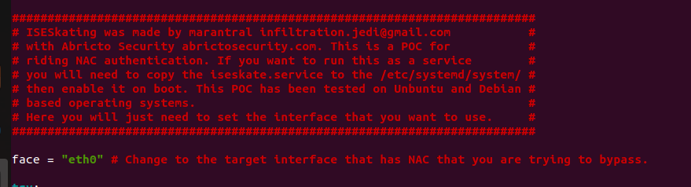
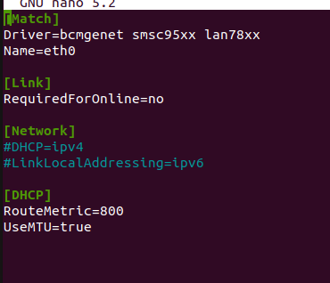
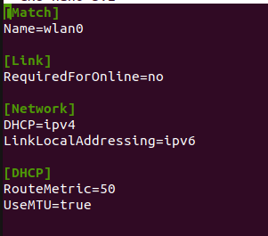

# ISE SKATING<br />
<p align="center">
  
</p>

ISE Skating is the process of riding IEEE 802.1X authentication. This repository is a collection of the process of how to set this up and the scripts needed to do it. 

## Setup 
```
sudo apt update 
sudo apt install python3-pip nmap -y
sudo pip3 install python-nmap
cd /opt/ && sudo git clone https://github.com/AbrictoSecurity/iseskating.git
```
This will install dependancies and download the repository. 

Inside of the "iseskate.py" you can adjust the target interface. 
<p align="left">
  
</p>

## Setting ISE SKATING as a service
1. You will have to determine how you will connect to the box. I use LTE card and connect to it through wireguard VPN. 
2. You will have to set the metrics for that interface to use it as the primary default gateway.
Below I am setting up the eth0 interface as the target and the wlan0 as my connection to my C2.
```
sudo cp /run/systemd/network/10-netplan-eth0.network /etc/systemd/network/10-netplan-eth0.network
sudo cp /run/systemd/network/10-netplan-wlan0.network /etc/systemd/network/10-netplan-wlan0.network
```
Make the target interface to look like below. IF IT IS A WIRED CONNECTION WITHIN Ubuntu!!!
<p align="left">
  
</p>

Make the C2 interface look like below.
<p align="left">
  
</p>

For good messure we are going to disable IPv6. 
```
sudo nano /etc/sysctl.conf
```
Within that file place the below lines.
```
net.ipv6.conf.all.disable_ipv6=1
net.ipv6.conf.default.disable_ipv6=1
```
Next we will add the iseskate.service to /etc/systemd/system/ folder and enable the service. 
```
sudo cp /opt/iseskating/iseskate.service /etc/systemd/system/iseskate.service
sudo systemctl enable iseskate.service
```

Now once you connect the device with an intermediate device that does not give off BDPUs that is connected to a NAC protected environment, it will bypass it and give you a good IP and free access. 


**ENJOY!!** :sunglasses:
